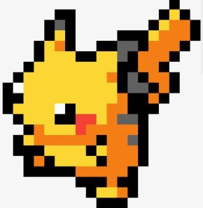
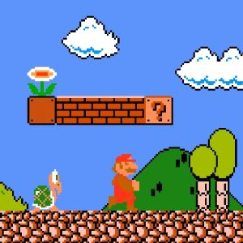

‘Pixel art’ is a form of digital art that harkens back to 8-bit and 16-bit era computers and gaming consoles. The limitations of the hardware of the time meant that developers were restricted to small color palettes and the art itself was often rather crude. The pixels were so large that the character sprites and backgrounds resemble lego structures. 

But like most things that define a culture and time period, those crude graphics have become endearing and nostalgic. It’s become so popular, in fact, that ‘pixel art’ is now a recognized and widely utilized artform. Principally in the space of video game design. 

And it’s not hard to understand why. The simplistic models are relatively easy to create and charming in design. The exact definitions of the medium are still somewhat hazy, but most can agree that manipulating ‘individual pixels’ in an image to marked effect, qualifies an image as ‘pixel art.

Personally, I’m only a spectator but I’ve developed a deep respect and admiration for the burgeoning art form and am quite eager to jump in. When it comes to programming, the general rule of thumb is that “the best way to get good at programming is to program.” It’s all about practice. And in a similar vein, one of the most conventional gateways into developing proficiency with a programming language is developing a video game using said language. And with that in mind, I look forward to combining my enthusiasm for pixel art, old school games and Javascript in order to create a reasonably fun (if simplistic) video game. 

